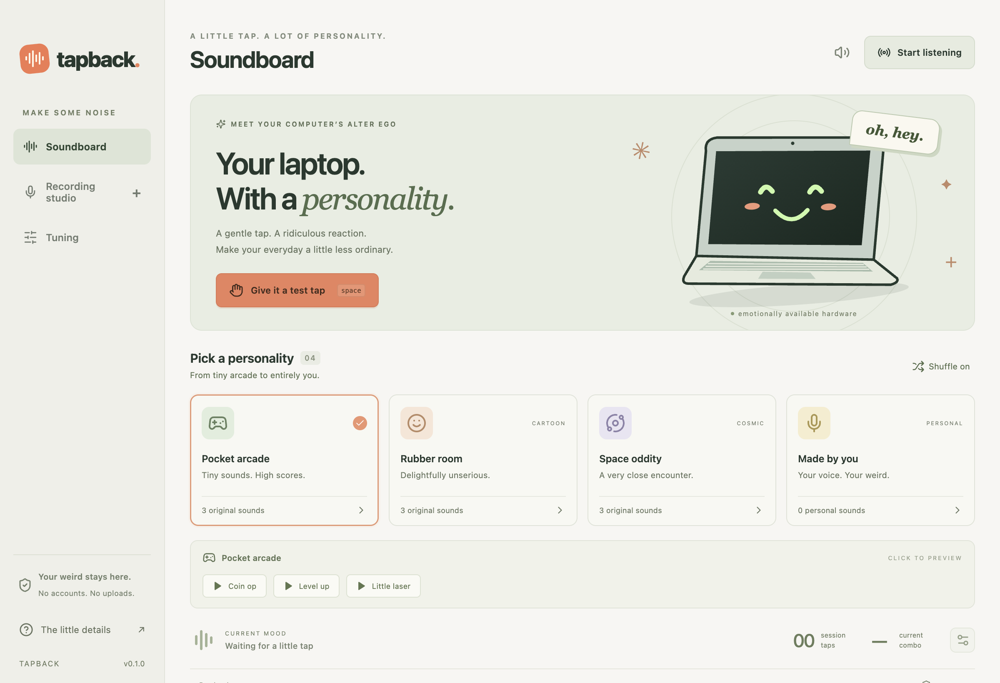

# TapBack

**A little tap. A lot of personality.** A playful, local-first desktop sound toy for macOS and Windows, inspired by the idea behind SlapMac. This is an independent implementation with original synthesized effects and your own recordings.



## Downloads

Get the [0.1.0 preview release](https://github.com/LethalYoyo/tapback/releases/tag/v0.1.0) for the Mac universal app, Windows x64 app, source archive, and checksums. These are development builds; read the compatibility and validation notes below before using them.

## Start playing

1. Open TapBack. Try **Give it a test tap** to hear a reaction.
2. Pick Pocket arcade, Rubber room, Space oddity, or Made by you.
3. Choose **Start listening** to enable microphone tap detection. Allow microphone access when prompted. A gentle tap on the desk near the microphone is enough.
4. In **Recording studio**, record up to 15 seconds or import WAV, MP3, OGG, WebM, or supported M4A audio. Trim it, name it, and save. TapBack selects your personal pack automatically.
5. Use **Tuning** for sensitivity, ambient calibration, volume, pitch, and input mode.

The app starts paused on every launch. Closing its window keeps it in the Mac menu bar or Windows system tray. Choose **Quit TapBack** there to exit completely. Locking or sleeping the computer pauses detection.

## What's included

- Nine original synthesized reactions in three themed packs.
- Personal voice recording, file import, waveform preview, trimming, renaming, and deletion.
- Select which personal sounds participate in the mix.
- No-repeat shuffle, tap-dependent volume, and pitch presets.
- Session and lifetime counters, expiring combos, and a reactive laptop character.
- Native menu bar / tray controls, global keyboard shortcuts, and optional launch at login.
- Quiet hours from 10 PM to 8 AM, local time, plus a quick mute.
- Portable `.tapback` sound-pack export/import. Packs contain the saved audio.
- All processing and storage remain local; no accounts, analytics, or network service.

Shortcuts: **⌘/Ctrl + Alt + T** plays a reaction; **⌘/Ctrl + Alt + M** mutes; **⌘/Ctrl + Alt + P** toggles listening. Space triggers a reaction when the test pad or the page itself has focus. If another app owns a shortcut, Tuning reports it.

## Compatibility — please read

| Input | macOS | Windows | Limitations |
| --- | --- | --- | --- |
| Manual pad / shortcuts | Yes | Yes | No microphone or sensor required. |
| Microphone transients | Yes | Yes | Requires microphone access. Voices, claps, typing, or other sharp sounds can trigger it. It is not a perfect physical-impact classifier. |
| Built-in accelerometer | Experimental Apple SPU adapter | WinRT accelerometer adapter | Requires compatible hardware and permission. Many devices expose no usable sensor. |

**The packaged Mac app connected to the local SPU sensor and delivered 138 real readings in a 1.2-second check.** A restricted development-shell run was denied access, so both success and denial paths were observed. Physical taps and false-positive rates have not been validated on a range of hardware. This version does not install a privileged helper or request administrator access. The Mac adapter does not support legacy Intel Sudden Motion Sensors. Microphone/manual modes work without that hardware.

Windows uses Windows PowerShell 5.1 and Microsoft's public `Windows.Devices.Sensors.Accelerometer` API. Corporate script policy, disabled sensors, missing hardware, or slow sensor reporting may prevent native detection. The Windows package was cross-built on macOS; Windows execution and physical sensor detection still need testing on a Windows machine.

Use light taps, never force. The manual pad is always available. TapBack's displayed strength is a relative signal level, not a calibrated physical-force measurement.

## Install the supplied builds

**Mac (macOS 13+):** Unzip the Mac download and move `TapBack.app` into Applications. The universal build contains Apple Silicon and Intel code. This is a development build with an ad-hoc signature, not an Apple-notarized release. If macOS blocks it, review it under System Settings → Privacy & Security. Do not disable Gatekeeper. The local `TapBack.app` supplied alongside this source can also be opened directly. To use the built-in accelerometer, choose **Tuning → Motion sensor → Start listening**.

**Windows:** Extract the entire ZIP to a folder you want to keep, then open `TapBack.exe`. Keep its resource files alongside it. This is an unsigned portable build; Windows may show an unrecognized-publisher warning. It targets Windows 10/11 x64. Native sensor mode additionally requires Windows PowerShell and sensor drivers.

## Build from source

Prerequisites: Node.js 22.12+ (Node 24 recommended), pnpm 11+, and Xcode Command Line Tools for Mac native builds. On Windows, use Windows PowerShell 5.1 for the sensor helper.

```sh
pnpm install --frozen-lockfile
pnpm build
pnpm start
```

For development with live UI reload:

```sh
pnpm build  # builds the native helper once
pnpm dev
```

Packaging:

```sh
# Run on a Mac; builds and locally signs a universal app and ZIP
pnpm package:mac

# Creates a Windows portable ZIP; may also be cross-built on a Mac
pnpm package:win
```

Build the frontend and Mac helper before packaging. Mac signing/notarization and Windows Authenticode signing require the distributor's credentials and are not configured here. Release configuration intentionally performs no publishing. On a system with a mismatched default Xcode SDK, set `SDKROOT` to a compatible installed SDK before `pnpm build`.

## Verification

```sh
pnpm test       # detector, persistence, validation, and pack tests
pnpm test:app   # launches Electron; uses a synthetic microphone, not your real mic
```

Desktop smoke tests exercise manual triggers, import, recording with a fake audio device, trimming/saving, native capability reporting, pause, calibration, mute, and persistence. They write isolated data and screenshots under `test-results/`. The tests do not establish hardware accuracy or Windows runtime compatibility. See [validation notes](docs/VALIDATION.md).

## Privacy and storage

- Microphone listening computes RMS/peak levels in memory. It does not save the incoming audio.
- Recording captures a maximum of 15 seconds per take. Only **Save sound** writes a clip to your library.
- Imported clips are decoded locally and saved as mono PCM WAV with short click-reducing fades at the trim boundaries. Pitch is applied during playback and also changes speed/duration.
- Audio playback suppresses detection through the full clip and a short release tail to reduce feedback loops. Previewing also suppresses detection.
- Recordings and settings live in Electron's per-user app data directory: usually `~/Library/Application Support/TapBack` on Mac or `%APPDATA%\TapBack` on Windows.
- Library limits: 50 clips, 40 MB total, 15 seconds per saved clip. Individual audio imports must be below 25 MB. Pack imports are validated before being applied.
- Sound-pack export includes your recorded audio. Share only what you intend to share.

## Development notes

React + TypeScript supplies the UI. Electron provides a sandboxed renderer, context-isolated preload, validated IPC, local protocol, menu/tray integration, and persistence. AudioWorklet processes microphone levels while the window is hidden. Web Audio provides decoding, synthesis, pitch, and output limiting. The C / PowerShell helpers emit bounded JSON sensor readings to the main process.

Read [research and design decisions](docs/RESEARCH.md) for the primary sources, tradeoffs, and remaining release work. MIT license; no proprietary SlapMac audio or source is bundled.
